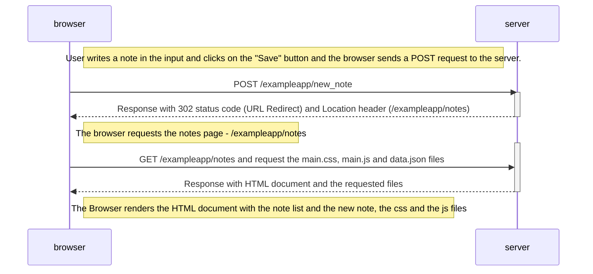

# Full Stack Open - Ejercicio 0.4

This is the sequence diagram for exercise 0.4 of the Full Stack Open course.

```mermaid
sequenceDiagram
    participant browser
    participant server

    Note right of browser: User writes a note in the input and clicks on the "Save" button and the browser sends a POST request to the server.
    browser->>server: POST /exampleapp/new_note
    activate server
    server-->>browser: Response with 302 status code (URL Redirect) and Location header (/exampleapp/notes)
    deactivate server

    Note right of browser: The browser requests the notes page - /exampleapp/notes
    activate server
    browser->>server: GET /exampleapp/notes and request the main.css, main.js and data.json files
    server-->>browser: Response with HTML document and the requested files
    deactivate server

    Note right of browser: The Browser renders the HTML document with the note list and the new note, the css and the js files
```
