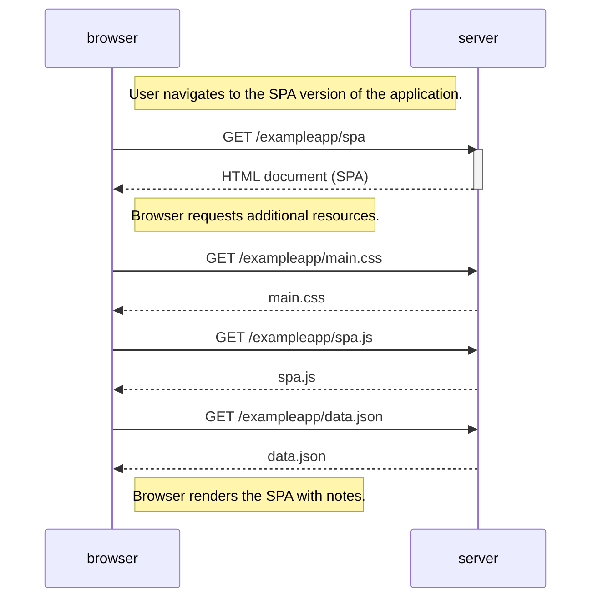

# Full Stack Open - Ejercicio 0.5

This is the sequence diagram for exercise 0.5 of the Full Stack Open course.

```mermaid
sequenceDiagram
    participant browser
    participant server

    Note right of browser: User navigates to the SPA version of the application.
    browser->>server: GET /exampleapp/spa
    activate server
    server-->>browser: HTML document (SPA)
    deactivate server

    Note right of browser: Browser requests additional resources.
    browser->>server: GET /exampleapp/main.css
    server-->>browser: main.css

    browser->>server: GET /exampleapp/spa.js
    server-->>browser: spa.js

    browser->>server: GET /exampleapp/data.json
    server-->>browser: data.json

    Note right of browser: Browser renders the SPA with notes.
```