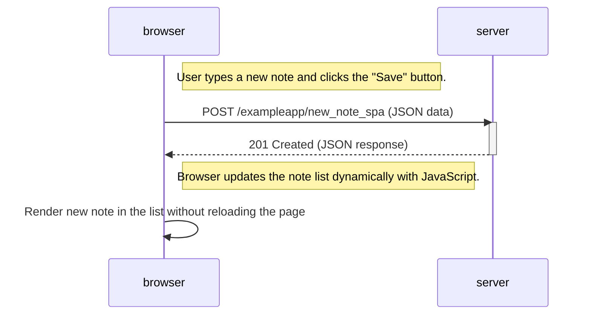

# Full Stack Open - Exercise 0.6

This is the sequence diagram for exercise 0.6 of the Full Stack Open course.

```mermaid
sequenceDiagram
    participant browser
    participant server

    Note right of browser: User types a new note and clicks the "Save" button.
    browser->>server: POST /exampleapp/new_note_spa (JSON data)
    activate server
    server-->>browser: 201 Created (JSON response)
    deactivate server

    Note right of browser: Browser updates the note list dynamically with JavaScript.
    browser->>browser: Render new note in the list without reloading the page
```